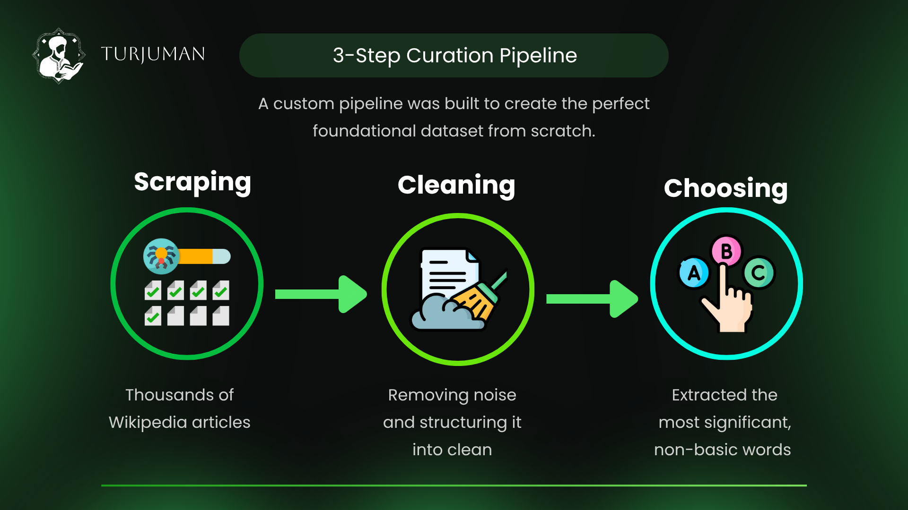
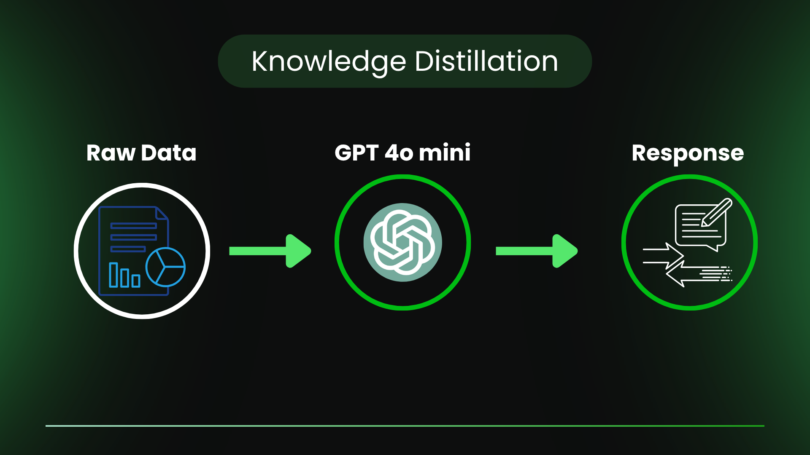
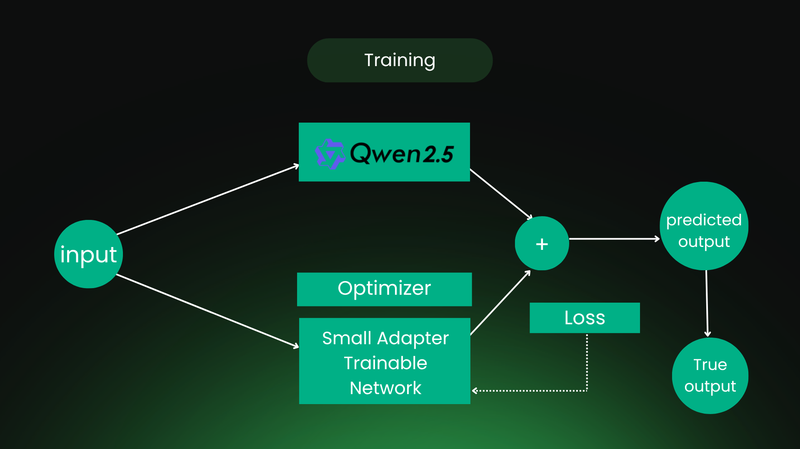
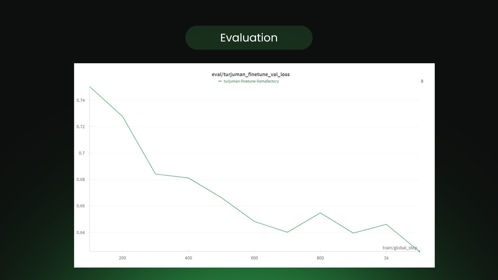
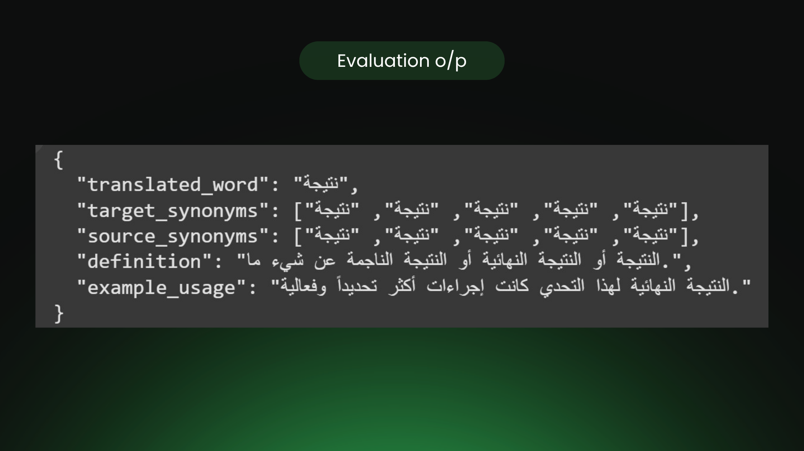
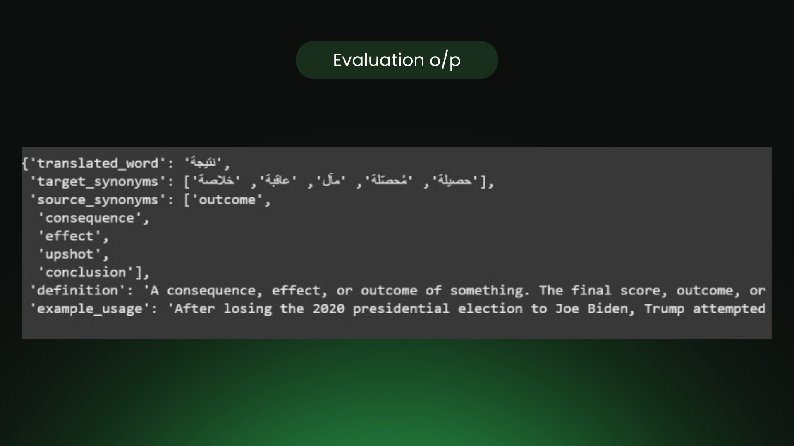

# Turjuman Model - Fine-Tuning Qwen-1.5B for Context-Aware English-to-Arabic Translation 
### Project Overview
This project is an end-to-end initiative to develop "Turjuman," a highly specialized and context-aware language model for English-to-Arabic translation. The core objective was to overcome the limitations of generic translation models by training a smaller, efficient model on a rich, custom-built dataset. The methodology involved two primary stages:

1. **Automated Dataset Creation**: A sophisticated pipeline was built to scrape data and generate high-quality, structured translation examples.

2. **Efficient Model Fine-Tuning**: The compact yet powerful **Qwen-1.5B** model was fine-tuned using the **LoRA** technique for optimal performance without the need for extensive computational resources.

## Phase 1: Data Pipeline & Knowledge Distillation
   

The foundation of this project was the creation of a unique, high-quality dataset. Generic datasets often lack the specific context needed for nuanced translation. To solve this, the following steps were taken:

1. **Diverse Topic Sourcing**: A list of varied topics (e.g., science, history, technology, arts) was generated to ensure the model's broad understanding.
2. **Web Scraping**: The Wikipedia API and BeautifulSoup were used to legally scrape content from relevant English articles for each topic. This raw text formed the initial corpus.
3. **Data Processing & Structuring**: The scraped text was segmented into smaller, context-rich paragraphs. For each paragraph, a target word was programmatically identified.
4. **Knowledge Distillation**: A powerful "teacher" model (GPT-4o-mini) was employed to process the raw text-word pairs. For each pair, it generated a structured JSON object containing:
    - The target word's translation in Arabic based on the provided context.
    - A list of Arabic and English synonyms.
    - A clear definition of the word.
    - An example of the word used in a sentence.
  
This process, known as Knowledge Distillation, allowed us to transfer the advanced capabilities of a large model into a perfectly structured dataset ideal for supervised fine-tuning.

## Phase 2: Model Fine-Tuning

With a high-quality dataset of over 3,000 structured examples, the next phase focused on training the student model efficiently.

1. **Model Selection**: **Qwen-1.5B-Instruct** was chosen as the base model due to its excellent performance-to-size ratio, making it ideal for specialization.

2. **Framework**: The entire training process was managed using the **LLaMA-Factory** framework, which simplifies and streamlines fine-tuning workflows.

3. **Efficient Fine-Tuning with LoRA**: To make the training computationally efficient, Low-Rank Adaptation **(LoRA)** was implemented via the peft library. This technique involves training only a small subset of the model's weights, significantly reducing memory and time requirements while achieving results comparable to full fine-tuning.

4. **Experiment Tracking**: The training process, including metrics like loss and performance, was meticulously tracked and visualized using **Weights & Biases (W&B)**.

------------------------
### Project Outcome
The result of this project is "Turjuman," a fine-tuned model that excels at providing detailed, context-aware translations from English to Arabic. The model demonstrated strong learning progress during training. Notably, around the halfway mark of the fine-tuning process, it achieved a promising training loss of 0.405 and a validation loss of 0.62, indicating effective generalization on the custom-built dataset.  

### The effectiveness of the fine-tuning process is visually represented in the output comparisons below..
### Before

### After

------------------------
### Technology Stack
- Base Model: Qwen-1.5B

- Teacher Model: GPT-4o-mini

- Frameworks: LLaMA-Factory, PyTorch, Transformers

- Fine-Tuning: PEFT (LoRA), Supervised Fine-Tuning (SFT), Knowledge Distillation

- Data Collection: Wikipedia API, BeautifulSoup, NLTK

- Experiment Tracking: Weights & Bienses (W&B)
